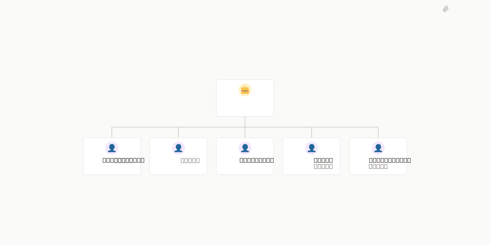

# Humanio 

## What's Inside

> This is an [Agent Company](https://agentcompanies.io) package from [Paperclip](https://paperclip.ing)

| Content | Count |
|---------|-------|
| Agents | 10 |
| Projects | 1 |
| Skills | 51 |
| Tasks | 2 |

### Agents

| Agent | Role | Reports To |
|-------|------|------------|
| CEO | CEO | — |
| Scout | general | ceo |
| Qualifier | general | ceo |
| DesignPlanner | general | ceo |
| WebBuilder | general | ceo |
| WebQA | general | ceo |
| WebPublisher | general | ceo |
| Outreach | general | ceo |
| Closer | general | ceo |
| DataAnalyst | researcher | ceo |

### Business Model

| Package | Price | Includes |
|---------|-------|----------|
| Starter | $27 USD/mo | Professional website + WhatsApp link + contact form |
| Pro | $47 USD/mo | All Starter + WhatsApp Chatbot with business info |
| Business | $97 USD/mo | All Pro + AI Chatbot with appointment scheduling |

### Pipeline

```text
Scout → Qualifier → DesignPlanner → WebBuilder → WebQA → WebPublisher → Outreach → Closer
                              ↘
                           DataAnalyst
```

### Production Logic

Humanio works in two web delivery modes:

- `template` for cold outbound prospects with no explicit buying signal
- `premier` for inbound, demo-requested, urgent, or CEO-prioritized opportunities

All prospects still receive:
- landing page
- proposal page
- diagnostic / report page

What changes is the level of customization of the landing page.

### Projects

- **Onboarding**

### Skills

51 skills including: alert-manager, backlink-analyzer, competitor-analysis, content-gap-analysis, content-quality-auditor, content-refresher, domain-authority-auditor, entity-optimizer, geo-content-optimizer, internal-linking-optimizer, keyword-research, memory-management, meta-tags-optimizer, on-page-seo-auditor, performance-reporter, rank-tracker, schema-markup-generator, seo-content-writer, serp-analysis, technical-seo-checker, frontend-design, outreach-proposals, qualifier-prospect-auditor, qualifier-seo, scout-prospector, frontend-design-review, frontend-ui-dark-ts, closer-sales, sales-copywriting, dataanalyst-pipeline, web-qa, qualifier-diagnostic-html, package-pricing, package-outreach, saas-metrics, retention-playbook, ui-ux-pro-max, paperclip-create-agent, paperclip-create-plugin, paperclip, para-memory-files, objection-handling, social-selling, cold-outreach, lead-qualification, web-scraping, web-template-system, web-premier-system, layout-blueprints, design-styles, dataanalyst-dashboard-html

## Getting Started

```bash
pnpm paperclipai company import this-github-url-or-folder
```

See [Paperclip](https://paperclip.ing) for more information.

---

> Humanio — Inteligencia Artificial para negocios
